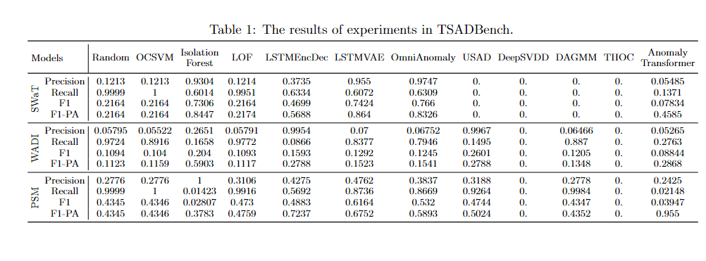

# TSADBench
**This repository has not been updated recently, and not compeleted, so I recommend you to refer to my repo just as a reference.**

This repository contains Time-Series Anomaly Detection datasets, models, and their implementations.
If you find any issues for this repository, such as errors in code, better hyperparameters, etc, please report through Issue channel or via pull request.

## Experiments So Far

[20230522: deleted SMD, SMAP, MSL] There seems to be problem in datasets (SMD, SMAP, MSL) preprocessing, so let me update for these datasets later.

"*0.*" denotes that experiment hasn't finished. 


## QuickRun
For individual run, 
```bash
python main.py dataset=${dataset_name} model={model_name} {{other arguments}}
python main.py dataset=NeurIPS-TS-MUL model=USAD exp_id=default model.latent_dim=40 # example
```
If you want to run the model for various dataset,
```bash
sh scripts/data_loop.sh ${model_name} ${gpu_id}
sh scripts/data_loop.sh AnomalyTransformer 1 # example
```

If you want to compare models' performace for a specific dataset,
```bash
sh scripts/model_loop.sh ${data_name} ${gpu_id}
sh scripts/model_loop.sh SWaT 3 # example
```

for more script running examples, 
take a look at [scripts dir](https://github.com/carrtesy/TSADBench/tree/master/scripts).

## Hyperparameter Tuning
This repo utilizes [wandb](https://wandb.ai/site) and [hydra](https://hydra.cc/docs/intro/) for experiment tracking.
You can tune your hyperparameters via:
```bash
wandb sweep ${yaml_file}
wandb agent ${sweep_id}
```
For hyperparameter tuning examples, take a look at [hptune dir](https://github.com/carrtesy/TSADBench/tree/master/hptune).


## Dataset preparation

For list of dataset details, please refer to our [notion dataset page](https://carrtesy.notion.site/79cb1d595ec746a3a4c8371cedb2c608?v=440fdfeea2dc489d806e72b85d3d4da6). You may also take a look at [EDA dir](https://github.com/carrtesy/TSADBench/tree/master/EDA) for exploratory data analysis.

All datasets are assumed to be in "data" folder. 

1. Toy Dataset (toyUSW) : We have created toy dataset to test algorithms promptly. [train.npy](data/toyUSW/train.npy) contains periodic sine waves. [test.npy](data/toyUSW/test.npy) has abnormal situations (stopped signal) and anomalies are labeled in file [test_label.npy](data/toyUSW/test_label.npy).  

NeurIPS-TS dataset are created using the principles in https://openreview.net/forum?id=r8IvOsnHchr.
We prepared Univariate/Multivariate dataset, for each data length being 1000.
For data generation, please refer to [univariate_generator](https://github.com/carrtesy/DeepTSAD/blob/master/data/univariate_generator.py), [multivariate_generator](https://github.com/carrtesy/DeepTSAD/blob/master/data/multivariate_generator.py).

2. NeurIPS-TS-UNI

3. NeurIPS-TS-MUL

SWaT and WADI dataset has two types of data: train (normal) and test (abnormal).
Train set does not contain anomaly set. Test set has anomalies driven by researcher's attack scenarios.
Request via guidelines in the [link](https://itrust.sutd.edu.sg/itrust-labs_datasets/dataset_info/).

4. SWaT (2022-10-25) : Secure Water Treatment Dataset
- With shared google drive link after request, refer to *SWaT.A1 & A2_Dec 2015*
- For Normal Dataset, refer to ./Physical/SWaT_Dataset_Normal_v0.xlsx
- For Attack Dataset, refer to ./Physical/SWaT_Dataset_Attack_v0.xlsx
- convert xlsx using *read_xlsx_and_convert_to_csv* in utils/tools.py

5. WADI (2022-10-25) : Water Distribution Dataset
- With shared google drive link after request, refer to *WADI.A2_19 Nov 2019*
- For Normal Dataset, refer to ./WADI_14days_new.csv
- For Attack Dataset, refer to ./WADI_attackdataLABLE.csv


6. PSM : Pooled Server Metrics Dataset

<strike>SMD, SMAP, MSL are provided in https://github.com/thuml/Anomaly-Transformer.</strike>

<strike>7. SMD : Server Machine Dataset</strike>
 
<strike>8. SMAP : Soil Moisture Active Passive satellite Dataset</strike>

<strike>9. MSL : Mars Science Laboratory Dataset</strike>

There seems to be problem in datasets (SMD, SMAP, MSL) preprocessing, so let me update for this dataset later.

10. To be updated

## Anomaly detection models

1. RandomModel: No training, returns anomaly_score ~ uniform[0,1]
2. OCSVM [David M. J. Tax, Robert P. W. Duin:
"Support Vector Data Description.", Mach. Learn. 54(1): 45-66 (2004)](https://homepage.tudelft.nl/a9p19/papers/ML_SVDD_04.pdf)
3. Isolation Forest [Fei Tony Liu, Kai Ming Ting, Zhi-Hua Zhou:
Isolation Forest. ICDM 2008: 413-422](https://cs.nju.edu.cn/zhouzh/zhouzh.files/publication/icdm08b.pdf?q=isolation-forest)
4. LOF [Markus M. Breunig, Hans-Peter Kriegel, Raymond T. Ng, Jörg Sander:
LOF: Identifying Density-Based Local Outliers. SIGMOD Conference 2000: 93-104](https://dl.acm.org/doi/pdf/10.1145/335191.335388) 
5. LSTMEncDec [Malhotra, Pankaj, et al. "LSTM-based encoder-decoder for multi-sensor anomaly detection."(2016).](https://arxiv.org/pdf/1607.00148v2.pdf)
6. LSTMVAE: [Daehyung Park, Yuuna Hoshi, Charles C. Kemp:
A Multimodal Anomaly Detector for Robot-Assisted Feeding Using an LSTM-Based Variational Autoencoder. IEEE Robotics Autom. Lett. 3(2): 1544-1551 (2018)](https://arxiv.org/pdf/1711.00614.pdf)
7. OmniAnomaly [Su, Ya, et al. "Robust anomaly detection for multivariate time series through stochastic recurrent neural network." Proceedings of the 25th ACM SIGKDD International Conference on Knowledge Discovery & Data Mining. 2019.](https://dl.acm.org/doi/pdf/10.1145/3292500.3330672?casa_token=k52TYpPsw2QAAAAA:5PQRaCv7bH507y-pnpvFqLM_TDUmMMTlZU24P8coKzZmT6LVtFC-8dh8AmhTJ_kYZFl11NyxBSGi)
8. USAD [Audibert, Julien, et al. "Usad: Unsupervised anomaly detection on multivariate time series." Proceedings of the 26th ACM SIGKDD International Conference on Knowledge Discovery & Data Mining. 2020.](https://dl.acm.org/doi/pdf/10.1145/3394486.3403392)
9. DeepSVDD [Lukas Ruff, Nico Görnitz, Lucas Deecke, Shoaib Ahmed Siddiqui, Robert A. Vandermeulen, Alexander Binder, Emmanuel Müller, Marius Kloft:
Deep One-Class Classification. ICML 2018: 4390-4399](https://proceedings.mlr.press/v80/ruff18a.html)
10. DAGMM [Bo Zong, Qi Song, Martin Renqiang Min, Wei Cheng, Cristian Lumezanu, Dae-ki Cho, Haifeng Chen: Deep Autoencoding Gaussian Mixture Model for Unsupervised Anomaly Detection. ICLR (Poster) 2018](https://openreview.net/forum?id=BJJLHbb0-)
11. THOC [Lifeng Shen, Zhuocong Li, James T. Kwok: Timeseries Anomaly Detection using Temporal Hierarchical One-Class Network. NeurIPS 2020](https://proceedings.neurips.cc/paper/2020/file/97e401a02082021fd24957f852e0e475-Paper.pdf)
12. Anomaly Transformer [Jiehui Xu, Haixu Wu, Jianmin Wang, Mingsheng Long:
Anomaly Transformer: Time Series Anomaly Detection with Association Discrepancy. ICLR 2022
](https://openreview.net/forum?id=LzQQ89U1qm_)

## References
- OCSVM (Sklearn): https://scikit-learn.org/stable/modules/generated/sklearn.svm.OneClassSVM.html
- IsolationForest (Sklearn): https://scikit-learn.org/stable/modules/generated/sklearn.ensemble.IsolationForest.html
- LOF (Sklearn): https://scikit-learn.org/stable/modules/generated/sklearn.neighbors.LocalOutlierFactor.html
- LSTMEncDec Implementation: https://joungheekim.github.io/2020/11/14/code-review/ (Explanations in Korean)
- LSTMVAE: https://github.com/carrtesy/LSTMVAE-Pytorch
- DeepSVDD (PyOD): https://pyod.readthedocs.io/en/latest/pyod.models.html#pyod.models.deep_svdd.DeepSVDD
- DAGMM : https://github.com/tnakae/DAGMM (Unoffical Pytorch)
- Anomaly Transformer Github: https://github.com/thuml/Anomaly-Transformer
